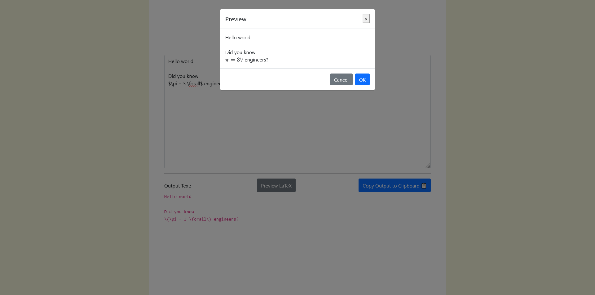
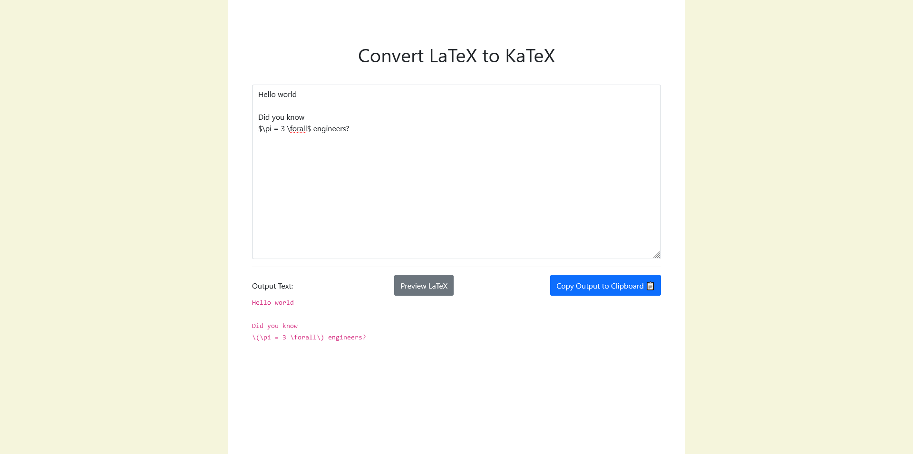

# LaTeX to KaTeX Converter

 

Converts LaTeX to KaTeX (which is used by [Moodle](https://moodle.org/)) 

Based on [github.com/Zeyu-Li/latex-moodle-converter](https://github.com/Zeyu-Li/latex-moodle-converter) but ported to Vue.js + additional features

## Preview

